# git

> https://git-scm.com/

## git 安装


> https://git-scm.com/book/zh/v2/%E8%B5%B7%E6%AD%A5-%E5%AE%89%E8%A3%85-Git


##  git 命令


####  配置user信息

> 配置user.name 和 user.email


> git config --global user.name 'your_name'
>
> git config --global user.email 'your_email@domain.com'


#### config的三个作用域

###### 三个作用域

> 缺省等于local


> git config --local				local只对某个仓库有效
>
> git config --global				global对当前用户所有仓库有效 
>
> git config --system			system对系统所有登录的用户有效

###### 显示config的配置 加 --list

>  git config --list --local


>  git config --list --global


>  git config --list --system


#### 建git的仓库

> 把已有的项目代码纳入git管理

```nginx
$ cd 项目的目录
$ git init
```

> 新建的项目直接用Git管理

```nginx
$ cd 某个项目的目录下
$ git init your_project
$ cd your_project
```


#### 往仓库里添加文件

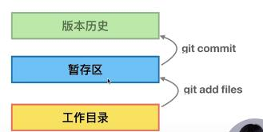


> 查看git的工作目录与暂存区状态
>
> Untracked files: 没有放入暂存区
>
> Changes to be committed:  已经放入暂存区

```nginx
$ git status
$ git add file1 file2 ....
$ git add -u //将工作空间被修改和被删除的文件添加到暂存区(不包含没有纳入Git管理的新增文件)
$ git commit -m "first commit"
$ git log 
```

> git log
>
> commit a24e5f0897dada1c6f8a01c5cf29436f63fed86d (HEAD -> master)
> Author: user.name <user.email>
> Date:   Sun Dec 16 13:11:49 2018 +0800
>
> first commit  //提交的信息


#### 给文件重命名的简便方式

> 将工作区index.html 重名成homepage.html

##### 方法一

- 在工作区将index.html 重命名为 homepage.html

```nginx
  mv index.html homepage.html
```

- 查看状态

  >  deleted:    index.html
  >
  >  Untracked files: homepage.html
  >
  >  Git以为进行了两步操作先删除index.html然后创建了一个新的homepage.html文件

```nginx
$ git status
```

- 加入暂存区

```nginx
$ git add homepage.html
$ git rm -r index.html
```

- 查看状态

  > Changes to be committed:  renamed:    index.html -> homepage.html

```nginx
$ git status
```

​	

##### 方法二

- git mv

```nginx
git mv index.html homepage.html
```

- git status

  > Changes to be committed:renamed:    index.html -> homepage.html


#### 查看版本演变历史

- 简洁的查看版本提交历史

```nginx
$ git log --oneline
```

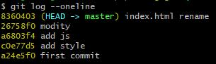

- 查看历史提交的前几条数据

```nginx
$ git log -n2 --oneline
```

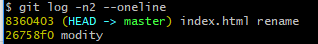

- 查看所有分支的提交记录

```nginx
$ git log --all
```

- 查看有多少个分支

```nginx
$ git branch -v 
```

- 创建并切换到当前分支

```nginx
$ git checkout -b branch_na
```

- 查看图形化的 log 地址

```nginx
$ git log --all --graph
```

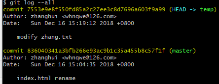

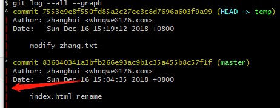

- 查看所有分支最近 4 条单行的图形化历史。

```nginx
$ git log --oneline --all --graph -n4
```

#### 图像化界面

```nginx
$ gitk
```


#### .git文件的解读


##### HEAD

> 当前的分支引用

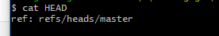

##### config

> 设置的用户名密码

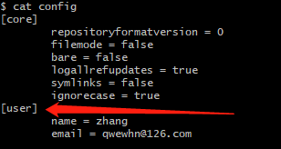

#### commit ,tree,blob三个对象之间的关系

> git cat-file -t  查看对象类型
>
> 一个commit包含有一tree
>
> 一个tree里面可以包含tree (映射到系统中就是文件夹)或者 blob（映射到系统中就是文件）
>
> 文件内容相同，git眼里就是唯一的blob


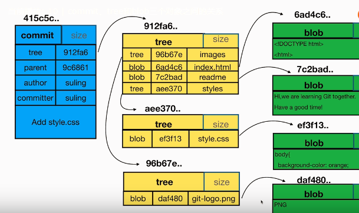


```nginx
$ git log
```

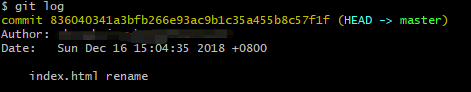

```nginx
$ git cat-file -p  836040341a3b
```

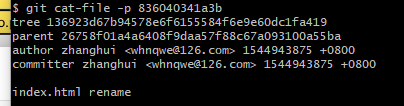

```nginx
git cat-file -p 136923d67
```

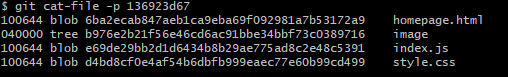

```nginx
git cat-file -p 6ba2ecab847
```

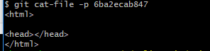


#### 分离头指针（detached HEAD）

> git checkout commit_id   切换到某个没有分支的commit下，进行修改


> 某个变更没有基于任何branch


#### HEAD 与 branch

> HEAD
>
> - 指向分支的最新一次的修改
> - 在分离头指针清空下，指向了某个commit上，没有和任何的分支挂钩

- 创建并切换到新分支

```nginx
$ git checkout -b newbranch
```

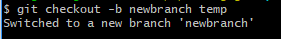

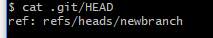


#### 怎么删除不需要的分支

```nginx
$ git branch -d branch_name
```

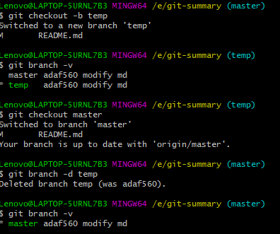


#### 修改最新的commit的message的信息

```nginx
$ git commit --amend
```

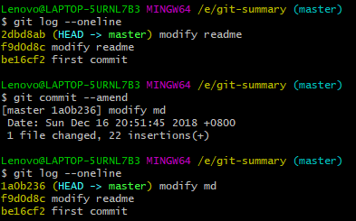


#### 修改老旧的commit的message的信息

```nginx
$ git rebase
```


